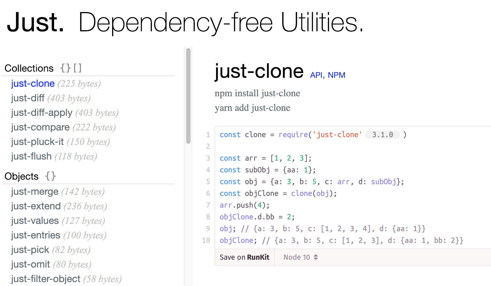

## Just

[](http://travis-ci.org/angus-c/just.js)

A library of **zero-dependency** npm modules that do just do one thing.
A guilt-free alternative to those bulkier utility libraries. Ideal for PWA development or whenever bytes are precious.

**[Jump To API](#the-modules-package)**

We welcome contributions. Please follow our [contribution guidelines](https://github.com/angus-c/just/blob/master/CONTRIBUTING.md).

## Try :icecream:

A [REPL](https://anguscroll.com/just) for every utility (powered by [RunKit](https://runkit.com))

<a href="https://anguscroll.com/just"></a>

## Read :books:

- [TRADEOFFS.md](https://github.com/angus-c/just/blob/master/TRADEOFFS.md) -- When to use Just (and when not to).
- [The Zen of Dependency-Free](https://medium.com/@angustweets/just-a12d54221f65#.ljib0mfr5) -- Why I wrote Just.

## TypeScript 

Right now, a handful of Just functions are type-defined in [Definitely Typed](https://github.com/DefinitelyTyped/DefinitelyTyped/pulls). We welcome additions. When available, you can install type definitions for a Just function like this:

```sh
# npm
npm i just-extend && npm i @types/just-extend -D

# yarn
yarn add just-extend && yarn add @types/just-extend -D
```

## Browser Support :computer:

Data based on [available saucelabs test browsers](https://github.com/angus-c/just/tree/sauce). It's likely _Just_ is also fully supported by some older versions not verifiable via saucelabs.

| Chrome | Safari | Firefox | IE/Edge | Node | Mobile Safari | Android       |
| ------ | ------ | ------- | ------- | ---- | ------------- | ------------- |
| yes    | yes    | yes     | IE9+    | 6+   | iOS 8+        | Android OS 5+ |

## The Modules :package:

- [Collections](#collections) {}[]
  - [just-diff](#just-diff)
  - [just-diff-apply](#just-diff-apply)
  - [just-compare](#just-compare)
  - [just-clone](#just-clone)
  - [just-pluck-it](#just-pluck-it)
  - [just-flush](#just-flush)
- [Objects](#objects) {}
  - [just-extend](#just-extend)
  - [just-merge](#just-merge)
  - [just-values](#just-values)
  - [just-entries](#just-entries)
  - [just-pick](#just-pick)
  - [just-omit](#just-omit)
  - [just-filter-object](#just-filter-object)
  - [just-map-object](#just-map-object)
  - [just-map-values](#just-map-values)
  - [just-map-keys](#just-map-values)
  - [just-reduce-object](#just-reduce-object)
  - [just-is-empty](#just-is-empty)
  - [just-is-circular](#just-is-circular)
  - [just-is-primitive](#just-is-primitive)
  - [just-safe-get](#just-safe-get)
  - [just-safe-set](#just-safe-set)
  - [just-typeof](#just-typeof)
  - [just-flip-object](#just-flip-object)
- [Arrays](#arrays) []
  - [just-unique](#just-unique)
  - [just-flatten-it](#just-flatten-it)
  - [just-index](#just-index)
  - [just-insert](#just-insert)
  - [just-intersect](#just-intersect)
  - [just-compact](#just-compact)
  - [just-last](#just-last)
  - [just-tail](#just-tail)
  - [just-random](#just-random)
  - [just-shuffle](#just-shuffle)
  - [just-split](#just-split)
  - [just-split-at](#just-split-at)
  - [just-partition](#just-partition)
  - [just-range](#just-range)
  - [just-remove](#just-remove)
  - [just-union](#just-union)
  - [just-zip-it](#just-zip-it)
- [Strings](#strings) ""
  - [just-template](#just-template)
  - [just-truncate](#just-truncate)
  - [just-prune](#just-prune)
  - [just-squash](#just-squash)
  - [just-left-pad](#just-left-pad)
  - [just-right-pad](#just-right-pad)
  - [just-camel-case](#just-camel-case)
  - [just-kebab-case](#just-kebab-case)
  - [just-snake-case](#just-snake-case)
  - [just-pascal-case](#just-pascal-case)
  - [just-capitalize](#just-capitalize)
- [Numbers](#numbers) +-
  - [just-clamp](#just-clamp)
  - [just-modulo](#just-modulo)
- [Functions](#functions) =>

  - [just-compose](#just-compose)
  - [just-curry-it](#just-curry-it)
  - [just-demethodize](#just-demethodize)
  - [just-flip](#just-flip)
  - [just-partial-it](#just-partial-it)
  - [just-debounce-it](#just-debounce-it)
  - [just-throttle](#just-throttle)
  - [just-once](#just-once)

  ### Collections

  ### [just-diff](https://www.npmjs.com/package/just-diff)

  :icecream:[`Try It`](https://anguscroll.com/just/just-diff)

  `npm install just-diff`

  Return an object representing the difference between two other objects
  Pass converter to format as http://jsonpatch.com

  ```js
  import {diff} from 'just-diff';

  const obj1 = {a: 4, b: 5};
  const obj2 = {a: 3, b: 5};
  const obj3 = {a: 4, c: 5};

  diff(obj1, obj2);
  [
    { "op": "replace", "path": ['a'], "value": 3 }
  ]

  diff(obj2, obj3);
  [
    { "op": "remove", "path": ['b'] },
    { "op": "replace", "path": ['a'], "value": 4 }
    { "op": "add", "path": ['c'], "value": 5 }
  ]

  // arrays
  const obj4 = {a: 4, b: [1, 2, 3]};
  const obj5 = {a: 3, b: [1, 2, 4]};
  const obj6 = {a: 3, b: [1, 2, 4, 5]};

  diff(obj4, obj5);
  [
    { "op": "replace", "path": ['a'], "value": 3 }
    { "op": "replace", "path": ['b', '2'], "value": 4 }
  ]

  diff(obj5, obj6);
  [
    { "op": "add", "path": ['b', '3'], "value": 5 }
  ]

  // nested paths
  const obj7 = {a: 4, b: {c: 3}};
  const obj8 = {a: 4, b: {c: 4}};
  const obj9 = {a: 5, b: {d: 4}};

  diff(obj7, obj8);
  [
    { "op": "replace", "path": ['b', 'c'], "value": 4 }
  ]

  diff(obj8, obj9);
  [
    { "op": "replace", "path": ['a'], "value": 5 }
    { "op": "remove", "path": ['b', 'c']}
    { "op": "add", "path": ['b', 'd'], "value": 4 }
  ]

  // using converter to generate jsPatch standard paths
  import {diff, jsonPatchPathConverter} from 'just-diff'

  diff(obj1, obj2, jsonPatchPathConverter);
  [
    { "op": "replace", "path": '/a', "value": 3 }
  ]

  diff(obj2, obj3, jsonPatchPathConverter);
  [
    { "op": "remove", "path": '/b' },
    { "op": "replace", "path": '/a', "value": 4 }
    { "op": "add", "path": '/c', "value": 5 }
  ]
  ```

### [just-diff-apply](https://www.npmjs.com/package/just-diff-apply)

:icecream:[`Try It`](https://anguscroll.com/just/just-diff-apply)

`npm install just-diff-apply`

Apply a diff object to an object.
Pass converter to apply a http://jsonpatch.com standard patch

```js
  import diffApply from 'just-diff-apply';

  const obj1 = {a: 3, b: 5};
  diffApply(obj1,
    [
      { "op": "remove", "path": ['b'] },
      { "op": "replace", "path": ['a'], "value": 4 },
      { "op": "add", "path": ['c'], "value": 5 }
    ]
  );
  obj1; // {a: 4, c: 5}

  // arrays
  const obj3 = {a: 4, b: [1, 2, 3]};
  diffApply(obj3, [
    { "op": "replace", "path": ['a'], "value": 3 }
    { "op": "replace", "path": ['b', '2'], "value": 4 }
    { "op": "add", "path": ['b', '3'], "value": 9 }
  ]);
  obj3; // {a: 3, b: [1, 2, 4, 9]}

  // nested paths
  const obj4 = {a: 4, b: {c: 3}};
  diffApply(obj4, [
    { "op": "replace", "path": ['a'], "value": 5 }
    { "op": "remove", "path": ['b', 'c']}
    { "op": "add", "path": ['b', 'd'], "value": 4 }
  ]);
  obj4; // {a: 5, b: {d: 4}}

  // using converter to apply jsPatch standard paths
  // see http://jsonpatch.com
  import {diffApply, jsonPatchPathConverter} from 'just-diff-apply'

  const obj2 = {a: 3, b: 5};
  diffApply(obj2, [
    { "op": "remove", "path": '/b' },
    { "op": "replace", "path": '/a', "value": 4 }
    { "op": "add", "path": '/c', "value": 5 }
  ], jsonPatchPathConverter);
  obj2; // {a: 4, c: 5}
```

### [just-compare](https://www.npmjs.com/package/just-compare)

:icecream:[`Try It`](https://anguscroll.com/just/just-compare)

`npm install just-compare`

```js
import compare from 'just-compare';

// primitives: value1 === value2
// functions: value1.toString == value2.toString
// arrays: if length, sequence and values of properties are identical
// objects: if length, names and values of properties are identical
compare([1, [2, 3]], [1, [2, 3]]); // true
compare([1, [2, 3], 4], [1, [2, 3]]); // false
compare({ a: 2, b: 3 }, { a: 2, b: 3 }); // true
compare({ a: 2, b: 3 }, { b: 3, a: 2 }); // true
compare({ a: 2, b: 3, c: 4 }, { a: 2, b: 3 }); // false
compare({ a: 2, b: 3 }, { a: 2, b: 3, c: 4 }); // false
compare([1, [2, { a: 4 }], 4], [1, [2, { a: 4 }]]); // false
compare([1, [2, { a: 4 }], 4], [1, [2, { a: 4 }], 4]); // true
compare(NaN, NaN); // true
```

### [just-clone](https://www.npmjs.com/package/just-clone)

:icecream:[`Try It`](https://anguscroll.com/just/just-clone)

`npm install just-clone`

```js
import clone from 'just-clone';

// Deep copies objects and arrays, doesn't clone functions

var arr = [1, 2, 3];
var subObj = { aa: 1 };
var obj = { a: 3, b: 5, c: arr, d: subObj };
var objClone = clone(obj);
arr.push(4);
objClone.d.bb = 2;
obj; // {a: 3, b: 5, c: [1, 2, 3, 4], d: {aa: 1}}
objClone; // {a: 3, b: 5, c: [1, 2, 3], d: {aa: 1, bb: 2}}
```

### [just-pluck-it](https://www.npmjs.com/package/just-pluck-it)

:icecream:[`Try It`](https://anguscroll.com/just/just-pluck-it)

`npm install just-pluck-it`

```js
import pluck from 'just-pluck-it';

pluck([{ a: 1, b: 2 }, { a: 4, b: 3 }, { a: 2, b: 5 }], 'a'); // [1, 4, 2]
pluck({ x: { a: 1, b: 2 }, y: { a: 4, b: 3 }, z: { a: 2, b: 5 } }, 'a'); // {x: 1, y: 4, z: 2}
```

### [just-flush](https://www.npmjs.com/package/just-flush)

:icecream:[`Try It`](https://anguscroll.com/just/just-flush)

`npm install just-flush`

```js
import flush from 'just-flush';

flush([1, undefined, 2, null, 3, NaN, 0]); // [1, 2, 3, NaN, 0]
flush([true, null, false, true, [null], undefined]); // [true, false, [null], true]
flush({ a: 2, b: null, c: 4, d: undefined }); // {a: 2, c: 4}
flush('something'); // undefined
flush(); // undefined
```

### Objects

### [just-extend](https://www.npmjs.com/package/just-extend)

:icecream:[`Try It`](https://anguscroll.com/just/just-extend)

`npm install just-extend`

```js
import extend from 'just-extend';

var obj = {a: 3, b: 5};
extend(obj, {a: 4, c: 8}); // {a: 4, b: 5, c: 8}
obj; // {a: 4, b: 5, c: 8}

var obj = {a: 3, b: 5};
extend({}, obj, {a: 4, c: 8}); // {a: 4, b: 5, c: 8}
obj; // {a: 3, b: 5}

var arr = [1, 2, 3];
var obj = {a: 3, b: 5};
extend(obj, {c: arr}); // {a: 3, b: 5, c: [1, 2, 3]}
arr.push(4);
obj; // {a: 3, b: 5, c: [1, 2, 3, 4]}

var arr = [1, 2, 3];
var obj = {a: 3, b: 5};
extend(true, obj, {c: arr}); // {a: 3, b: 5, c: [1, 2, 3]}
arr.push(4);
obj; // {a: 3, b: 5, c: [1, 2, 3]}

extend({a: 4, b: 5}); // {a: 4, b: 5}
extend({a: 4, b: 5}, 3); {a: 4, b: 5}
extend({a: 4, b: 5}, true); {a: 4, b: 5}
extend('hello', {a: 4, b: 5}); // throws
extend(3, {a: 4, b: 5}); // throws
```

### [just-merge](https://www.npmjs.com/package/just-merge)

:icecream:[`Try It`](https://anguscroll.com/just/just-merge)

`npm install just-merge`

```js
import merge from 'just-merge';

let obj = { a: 3, b: 5 };
merge(obj, { a: 4, c: 8 }); // {a: 4, b: 5, c: 8}
obj; // {a: 4, b: 5, c: 8}

let obj = { a: 3, b: 5 };
merge({}, obj, { a: 4, c: 8 }); // {a: 4, b: 5, c: 8}
obj; // {a: 3, b: 5}

let arr = [1, 2, 3];
let obj = { a: 3, b: 5 };
merge(obj, { c: arr }); // {a: 3, b: 5, c: [1, 2, 3]}
arr.push[4];
obj; // {a: 3, b: 5, c: [1, 2, 3, 4]}

merge({ a: 4, b: 5 }); // {a: 4, b: 5}
merge(3, { a: 4, b: 5 }); // throws
merge({ a: 4, b: 5 }, 3); // throws
merge({ a: 4, b: 5 }, { b: 4, c: 5 }, 'c'); // throws
```

### [just-values](https://www.npmjs.com/package/just-values)

:icecream:[`Try It`](https://anguscroll.com/just/just-values)

`npm install just-values`

```js
import values from 'just-values';

values({ a: 4, c: 8 }); // [4, 8]
values({ a: { aa: 2 }, b: { bb: 4 } }); // [{aa: 2}, {bb: 4}]
values({}); // []
values([1, 2, 3]); // [1, 2, 3]
values(function(a, b) {
  return a + b;
}); // []
values(String('hello')); // []
values(1); // throw exception
values(true); // throw exception
values(undefined); // throw exception
values(null); // throw exception
```

### [just-entries](https://www.npmjs.com/package/just-entries)

:icecream:[`Try It`](https://anguscroll.com/just/just-entries)

`npm install just-entries`

```js
import entries from 'just-entries';

// Object:
entries({ c: 8, a: 4 }); // [['c', 8], ['a', 4]]
entries({ b: { bb: 4 }, a: { aa: 2 } }); // [['b', {bb: 4}], ['a', {aa: 2}]]
entries({}); // []

// Array:
entries([{ c: 8 }, { a: 4 }]); // [[0, {c: 8}], [1, {a: 4}]]
entries(['À', 'mauvais', 'ouvrier', 'point', 'de', 'bon', 'outil']);
// [[0, 'À'], [1, 'mauvais'] ... [6, 'outil']]
entries([]); // []
```

### [just-pick](https://www.npmjs.com/package/just-pick)

:icecream:[`Try It`](https://anguscroll.com/just/just-pick)

`npm install just-pick`

```js
import pick from 'just-pick';

var obj = { a: 3, b: 5, c: 9 };
pick(obj, ['a', 'c']); // {a: 3, c: 9}
pick(obj, 'a', 'c'); // {a: 3, c: 9}
pick(obj, ['a', 'b', 'd']); // {a: 3, b: 5}
pick(obj, ['a', 'a']); // {a: 3}
```

### [just-omit](https://www.npmjs.com/package/just-omit)

:icecream:[`Try It`](https://anguscroll.com/just/just-omit)

`npm install just-omit`

```js
import omit from 'just-omit';

var obj = { a: 3, b: 5, c: 9 };
omit(obj, ['a', 'c']); // {b: 5}
omit(obj, 'a', 'c'); // {b: 5}
omit(obj, ['a', 'b', 'd']); // {c: 9}
omit(obj, ['a', 'a']); // {b: 5, c: 9}
```

### [just-is-empty](https://www.npmjs.com/package/just-is-empty)

:icecream:[`Try It`](https://anguscroll.com/just/just-is-empty)

`npm install just-is-empty`

```js
import isEmpty from 'just-is-empty';
 isEmpty({a: 3, b: 5}) // false
 isEmpty([1, 2]) // false
 isEmpty(new Set([1, 2, 2])) // false
 isEmpty((new Map()).set('a', 2)) // false
 isEmpty({}) // true
 isEmpty([]) // true
 isEmpty(new Set()) // true
 isEmpty(new Map()) // true
 isEmpty('abc') // false
 isEmpty('') // true
 isEmpty(0) // true
 isEmpty(1) // true
 isEmpty(true) // true
 isEmpty(Symbol('abc')); // true
 isEmpty(//); // true
 isEmpty(new String('abc')); // false
 isEmpty(new String('')); // true
 isEmpty(new Boolean(true)); // true
 isEmpty(null) // true
 isEmpty(undefined) // true
```

### [just-is-circular](https://www.npmjs.com/package/just-is-circular)

:icecream:[`Try It`](https://anguscroll.com/just/just-is-circular)

`npm install just-is-circular`

```js
import isCircular from 'just-is-circular';

const a = {};
a.b = a;
isCircular(a); // true

const a = {};
a.b = { c: a };
isCircular(a); // true

const a = {};
a.b = { c: 4 };
isCircular(a); // false

const a = [];
a.push(a);
isCircular(a); // true

isCircular({}); // false
isCircular('hi'); // false
isCircular(undefined); // false
```

### [just-is-primitive](https://www.npmjs.com/package/just-is-primitive)

:icecream:[`Try It`](https://anguscroll.com/just/just-is-primitive)

`npm install just-is-primitive`

```js
import isPrimitive from 'just-is-primitive';
isPrimitive('hi'); // true
isPrimitive(3); // true
isPrimitive(true); // true
isPrimitive(false); // true
isPrimitive(null); // true
isPrimitive(undefined); // true
isPrimitive(Symbol()); // true
isPrimitive({}); // false
isPrimitive([]); // false
isPrimitive(function() {}); // false
isPrimitive(new Date()); // false
isPrimitive(/a/); // false
```

### [just-filter-object](https://www.npmjs.com/package/just-filter-object)

:icecream:[`Try It`](https://anguscroll.com/just/just-filter-object)

`npm install just-filter-object`

```js
import filter from 'just-filter-object';

// returns a new object containing those original properties for which the predicate returns truthy
filter({ a: 3, b: 5, c: 9 }, (key, value) => value < 6); // {a: 3, b: 5}
filter({ a1: 3, b1: 5, a2: 9 }, (key, value) => key[0] == 'a'); // {a1: 3, a2: 9}
filter({ a: 3, b: 5, c: null }, (key, value) => value); // {a: 3, b: 5}
```

### [just-map-object](https://www.npmjs.com/package/just-map-object)

:icecream:[`Try It`](https://anguscroll.com/just/just-map-object)

`npm install just-map-object`

```js
import map from 'just-map-object';

// DEPRECATED: use just-map-values
map({ a: 3, b: 5, c: 9 }, (key, value) => value + 1); // {a: 4, b: 6, c: 10}
map({ a: 3, b: 5, c: 9 }, (key, value) => key); // {a: 'a', b: 'b', c: 'c'}
map({ a: 3, b: 5, c: 9 }, (key, value) => key + value); // {a: 'a3', b: 'b5', c: 'c9'}
```

### [just-map-values](https://www.npmjs.com/package/just-map-values)

:icecream:[`Try It`](https://anguscroll.com/just/just-map-values)

`npm install just-map-values`

```js
import map from 'just-map-values';

// predicate updates values, recieves (value, key, obj)
map({ a: 3, b: 5, c: 9 }, value => value + 1); // {a: 4, b: 6, c: 10}
map({ a: 3, b: 5, c: 9 }, (value, key) => value + key); // {a: 3a, b: 5b, c: 9c}
map({ a: 3, b: 5, c: 9 }, (value, key, obj) => obj.b); // {a: 5, b: 5, c: 5}
```

### [just-map-keys](https://www.npmjs.com/package/just-map-keys)

:icecream:[`Try It`](https://anguscroll.com/just/just-map-keys)

`npm install just-map-keys`

```js
import map from 'just-map-keys';

// predicate updates keys, recieves (value, key, object)
map({ a: 'cow', b: 'sheep', c: 'pig' }, value => value);
// {cow: 'cow', sheep: 'sheep', pig: 'pig'}
map([4, 5, 6], (value, key) => key + 1); // {1: 4, 2: 5, 3: 6}
map({ a: 3, b: 5, c: 9 }, (value, key) => key + value); // {a3: 3, b5: 5, c9: 9}
map({ a: 3, b: 5, c: 9 }, (value, key, obj) => obj.b + value + key);
// {'8a': 3, '10b': 5, '14c': 9}
```

### [just-reduce-object](https://www.npmjs.com/package/just-reduce-object)

:icecream:[`Try It`](https://anguscroll.com/just/just-reduce-object)

`npm install just-reduce-object`

```js
import reduce from 'just-reduce-object';

// applies a function against an accumulator and each key-value pairs of the object
// to reduce it to a single value
reduce(
  { a: 3, b: 5, c: 9 },
  (acc, key, value, index, keys) => {
    acc[value] = key;
    return acc;
  },
  {}
); // {3: 'a', 5: 'b', 9: 'c'}

reduce({ a: 3, b: 5, c: 9 }, (acc, key, value, index, keys) => {
  acc += value;
  return acc;
}); // 17
```

### [just-safe-get](https://www.npmjs.com/package/just-safe-get)

:icecream:[`Try It`](https://anguscroll.com/just/just-safe-get)

`npm install just-safe-get`

```js
import get from 'just-safe-get';

const obj = { a: { aa: { aaa: 2 } }, b: 4 };

get(obj, 'a.aa.aaa'); // 2
get(obj, ['a', 'aa', 'aaa']); // 2

get(obj, 'b.bb.bbb'); // undefined
get(obj, ['b', 'bb', 'bbb']); // undefined

get(obj.a, 'aa.aaa'); // 2
get(obj.a, ['aa', 'aaa']); // 2

get(obj.b, 'bb.bbb'); // undefined
get(obj.b, ['bb', 'bbb']); // undefined

get(null, 'a'); // null
get(undefined, 'a'); //undefined

const obj = { a: {} };
const sym = Symbol();
obj.a[sym] = 4;
get(obj.a, sym); // 4
```

### [just-safe-set](https://www.npmjs.com/package/just-safe-set)

:icecream:[`Try It`](https://anguscroll.com/just/just-safe-set)

`npm install just-safe-set`

```js
import set from 'just-safe-set';

const obj1 = {};
set(obj1, 'a.aa.aaa', 4}); // true
obj1; // {a: {aa: {aaa: 4}}}

const obj2 = {};
set(obj2, [a, aa, aaa], 4}); // true
obj2; // {a: {aa: {aaa: 4}}}

const obj3 = {a: {aa: {aaa: 2}}};
set(obj3, 'a.aa.aaa', 3); // true
obj3; // {a: {aa: {aaa: 3}}}

// don't clobber existing
const obj4 = {a: {aa: {aaa: 2}}};
set(obj4, 'a.aa', {bbb: 7}); // false

const obj5 = {a: {}};
const sym = Symbol();
set(obj5.a, sym, 7); // true
obj5; // {a: {Symbol(): 7}}
```

### [just-typeof](https://www.npmjs.com/package/just-typeof)

:icecream:[`Try It`](https://anguscroll.com/just/just-typeof)

`npm install just-typeof`

```js
import typeOf from 'just-typeof';

typeOf({}); // 'object'
typeOf([]); // 'array'
typeOf(function() {}); // 'function'
typeOf(/a/); // 'regexp'
typeOf(new Date()); // 'date'
typeOf(null); // 'null'
typeOf(undefined); // 'undefined'
typeOf('a'); // 'string'
typeOf(1); // 'number'
typeOf(true); // 'boolean'
```

### [just-flip-object](https://www.npmjs.com/package/just-flip-object)

:icecream:[`Try It`](https://anguscroll.com/just/just-flip-object)

`npm install just-flip-object`

```js
import flip from 'just-flip-object';

// flip the key and value
flip({ a: 'x', b: 'y', c: 'z' }); // {x: 'a', y: 'b', z: 'c'}
flip({ a: 1, b: 2, c: 3 }); // {'1': 'a', '2': 'b', '3': 'c'}
flip({ a: false, b: true }); // {false: 'a', true: 'b'}
```

### Arrays

### [just-unique](https://www.npmjs.com/package/just-unique)

:icecream:[`Try It`](https://anguscroll.com/just/just-unique)

`npm install just-unique`

```js
import unique from 'just-unique';

unique([1, 2, 3, 2, 3, 4, 3, 2, 1, 3]); // [1, 2, 3, 4]

var a = { a: 3 };
var b = { b: 4 };
var c = { c: 5 };
unique([a, a, b, c, b]); // [a, b, c]

unique([1, '1', 2, '2', 3, 2]); // [1, '1', 2, '2', 3]

// declaring sorted array for performance
unique([1, 1, '1', 2, 2, 5, '5', '5'], true); // [1, '1', 2, 5, '6']

// declaring strings array for performance
unique(['a', 'c', 'b', 'c', 'a'], false, true); // ['a', 'b', 'c']
```

### [just-flatten-it](https://www.npmjs.com/package/just-flatten-it)

:icecream:[`Try It`](https://anguscroll.com/just/just-flatten-it)

`npm install just-flatten-it`

```js
import flatten from 'just-flatten-it';

flatten([[1, [2, 3]], [[4, 5], 6, 7, [8, 9]]]);
// [1, 2, 3, 4, 5, 6, 7, 8, 9]
```

### [just-index](https://www.npmjs.com/package/just-index)

:icecream:[`Try It`](https://anguscroll.com/just/just-index)

`npm install just-index`

```js
import index from 'just-index';

index([{ id: 'first', val: 1 }, { id: 'second', val: 2 }], 'id');
// {first: {id: 'first', val: 1}, second: {id: 'second', val: 2}}
index([{ id: 'first', val: 1 }, null], 'id'); // {first: {id: 'first', val: 1}}
index([], 'id'); // {}
index([], null); // throws
index({}, 'id'); // throws
```

### [just-insert](https://www.npmjs.com/package/just-insert)

:icecream:[`Try It`](https://anguscroll.com/just/just-insert)

`npm install just-insert`

```js
import insert from 'just-insert';

insert([1, 2, 5, 6], ['a', 'c', 'e'], 2); // [1, 2, 'a', 'c', 'e', 5, 6]
insert([1, 2, 5, 6], 'a', 2); // [1, 2, 'a', 5, 6]
insert([1, 2, 5, 6], ['a', 'c', 'e'], 0); // ['a', 'c', 'e', 1, 2, 5, 6]
insert([1, 2, 5, 6], ['a', 'c', 'e']); // ['a', 'c', 'e', 1, 2, 5, 6]
```

### [just-intersect](https://www.npmjs.com/package/just-intersect)

:icecream:[`Try It`](https://anguscroll.com/just/just-intersect)

`npm install just-intersect`

```js
import intersect from 'just-intersect';

intersect([1, 2, 5, 6], [2, 3, 5, 6]); // [2, 5, 6]
intersect([1, 2, 2, 4, 5], [3, 2, 2, 5, 7]); // [2, 5]
```

### [just-compact](https://www.npmjs.com/package/just-compact)

:icecream:[`Try It`](https://anguscroll.com/just/just-compact)

`npm install just-compact`

```js
import compact from 'just-compact';

compact([1, null, 2, undefined, null, NaN, 3, 4, false, 5]); // [1, 2, 3, 4, 5]
compact([1, 2, [], 4, {}]); // [1, 2, [], 4, {}]
compact([]); // []
compact({}); // throws
```

### [just-last](https://www.npmjs.com/package/just-last)

:icecream:[`Try It`](https://anguscroll.com/just/just-last)

`npm install just-last`

```js
import last from 'just-last';

last([1, 2, 3, 4, 5]); // 5
last([{ a: 1 }, { b: 1 }, { c: 1 }]); // {c: 1}
last([true, false, [true, false]]); // [true, false]
last([]); // undefined
last(); // throws
last(null); // throws
last(undefined); // throws
```

### [just-tail](https://www.npmjs.com/package/just-tail)

:icecream:[`Try It`](https://anguscroll.com/just/just-tail)

`npm install just-tail`

```js
import tail from 'just-tail';

tail([1, 2, 3, 4, 5]); // [2, 3, 4, 5]
tail([{ a: 1 }, { b: 1 }, { c: 1 }]); // [{b: 1}, {c: 1}]
tail([true, false, [true, false]]); // [false, [true, false]]
tail([]); // []
tail(); // throws
tail(null); // throws
tail(undefined); // throws
```

### [just-random](https://www.npmjs.com/package/just-random)

:icecream:[`Try It`](https://anguscroll.com/just/just-random)

`npm install just-random`

```js
import random from 'just-random';

random([1, 2, 3]); // one of [1, 2, 3], at random
```

### [just-shuffle](https://www.npmjs.com/package/just-shuffle)

:icecream:[`Try It`](https://anguscroll.com/just/just-shuffle)

`npm install just-shuffle`

```js
import shuffle from 'just-shuffle';

shuffle([1, 2, 3]); // array with original elements randomly sorted
shuffle([1]); // [1]
shuffle(); // throws
shuffle(undefined); // throws
shuffle(null); // throws
shuffle({}); // throws
```

### [just-split](https://www.npmjs.com/package/just-split)

:icecream:[`Try It`](https://anguscroll.com/just/just-split)

`npm install just-split`

```js
import split from 'just-split';

split([]); // []
split([1, 2, 3, 4, 5]); // [[1, 2, 3, 4, 5]]
split([1, 2, 3, 4, 5, 6, 7, 8, 9], 3);
[[1, 2, 3], [4, 5, 6], [7, 8, 9]];
split(['a', 'b', 'c', 'd', 'e'], 2);
[['a', 'b'], ['c', 'd'], ['e']];
split([1, 2, 3, 4, 5, 6, 7, 8], 3);
[[1, 2, 3], [4, 5, 6], [7, 8]];
split({}, 3); // throws
split(null, 3); // throws
split([1, 2, 3, 4, 5, 6], '3'); // throws
```

### [just-split-at](https://www.npmjs.com/package/just-split-at)

:icecream:[`Try It`](https://anguscroll.com/just/just-split-at)

`npm install just-split-at`

```js
import splitAt from 'just-split-at';

splitAt([1, 2, 3, 4, 5], 2); // [[1, 2], [3, 4, 5]]
splitAt([{ a: 1 }, { b: 1 }, { c: 1 }], -1); // [[{a: 1}, {b: 1}], [{c: 1}]]
splitAt([], 2); // [[], []]
splitAt(null, 1); // throws
splitAt(undefined, 1); // throws
splitAt([1, 2, 3, 4, 5], {}); // throws
```

### [just-partition](https://www.npmjs.com/package/just-partition)

:icecream:[`Try It`](https://anguscroll.com/just/just-partition)

`npm install just-partition`

```js
import partition from 'just-partition';

partition([1, 5, 2, 4, 3], n => n > 3); // [[5, 4],[1, 2, 3]]
partition(['a', 2, 3, '3'], x => typeof x == 'string'); // [['a', '3'],[2, 3]]
partition([1, 2, 3, 4], x => typeof x == 'number'); // [[1, 2, 3, 4],[]]
partition([1, 2, 3, 4], x => typeof x == 'string'); // [[], [1, 2, 3, 4]]
partition([], n => n > 3); // [[], []]
partition({ a: 1, b: 2 }, n => n > 1); // throws
partition(null, n => n > 1); // throws
partition(undefined, n => n > 1); // throws
```

### [just-range](https://www.npmjs.com/package/just-range)

:icecream:[`Try It`](https://anguscroll.com/just/just-range)

`npm install just-range`

```js
import range from 'just-range';

range(1, 5); // [1, 2, 3, 4]
range(5); // [0, 1, 2, 3, 4]
range(-5); // [0, -1, -2, -3, -4]
range(0, 20, 5); // [0, 5, 10, 15]
```

### [just-remove](https://www.npmjs.com/package/just-remove)

:icecream:[`Try It`](https://anguscroll.com/just/just-remove)

`npm install just-remove`

```js
import remove from 'just-remove';

remove([1, 2, 3, 4, 5, 6], [1, 3, 6]); // [2, 4, 5]
```

### [just-union](https://www.npmjs.com/package/just-union)

:icecream:[`Try It`](https://anguscroll.com/just/just-union)

`npm install just-union`

```js
import union from 'just-union';

union([1, 2, 5, 6], [2, 3, 4, 6]); // [1, 2, 3, 4, 5, 6]
```

### [just-zip-it](https://www.npmjs.com/package/just-zip-it)

:icecream:[`Try It`](https://anguscroll.com/just/just-zip-it)

`npm install just-zip-it`

```js
import zip from 'just-zip-it';

zip([1, 2, 3]); // [[1], [2], [3]]
zip([1, 2, 3], ['a', 'b', 'c']); // [[1, 'a'], [2, 'b'], [3, 'c']]
zip([1, 2], ['a', 'b'], [true, false]); // [[1, 'a', true], [2, 'b', false]]
zip([1, 2, 3], ['a', 'b'], [true]); // [[1, 'a', true], [2, 'b', undefined], [3, undefined, undefined]]
zip(undefined, {}, false, 1, 'foo'); // throws
zip([1, 2], ['a', 'b'], undefined, {}, false, 1, 'foo'); // throws
```

### Strings

### [just-template](https://www.npmjs.com/package/just-template)

:icecream:[`Try It`](https://anguscroll.com/just/just-template)

`npm install just-template`

```js
import template from 'just-template';

const data = {
  a: {
    aa: {
      aaa: 'apple',
      bbb: 'pear'
    },
    bb: 'orange'
  },
  b: 'plum'
};
template(
  '2 ${a.aa.aaa}s, a ${a.aa.bbb}, 3 ${a.bb}s and a ${b}. Yes 1 ${a.aa.bbb}.',
  data
);
// '2 apples, a pear, 3 oranges and a plum. Yes 1 pear.'
```

### [just-truncate](https://www.npmjs.com/package/just-truncate)

:icecream:[`Try It`](https://anguscroll.com/just/just-truncate)

`npm install just-truncate`

```js
truncate('when shall we three meet again', 9); // 'when s...'
truncate('when shall we three meet again', 12, ' (etc)'); // 'when s (etc)'
truncate('when shall we', 15); // 'when shall we'
truncate('when shall we', 15, '(more)'); // 'when shall we'
truncate('when shall we', 10, ' (etc etc etc)'); // ' (etc etc etc)'
```

### [just-prune](https://www.npmjs.com/package/just-prune)

:icecream:[`Try It`](https://anguscroll.com/just/just-prune)

`npm install just-prune`

```js
  prune('when shall we three meet again', 7); // 'when...'
  prune('when shall we three meet again', 7, ' (more)'; // 'when (more)'
  prune('when shall we', 15,); // 'when shall we'
  prune('when shall we', 15, ' (etc)'); // 'when shall we'
  prune('when shall we', 7, ' (more)'); // ' (more)'
```

### [just-squash](https://www.npmjs.com/package/just-squash)

:icecream:[`Try It`](https://anguscroll.com/just/just-squash)

`npm install just-squash`

```js
squash('the cat sat on the mat'); // 'thecatsatonthemat'
squash(' the cat sat on the mat '); // 'thecatsatonthemat'
squash('\tthe cat\n sat \fon \vthe \rmat '); // '\tthecat\nsat\fon\vthe\rmat'
squash('\tthe cat\n sat \fon \vthe \rmat ', true); // 'thecatsatonthemat'
squash(
  `the cat
sat on the mat`,
  true
); // thecatsatonthemat
```

### [just-left-pad](https://www.npmjs.com/package/just-left-pad)

:icecream:[`Try It`](https://anguscroll.com/just/just-left-pad)

`npm install just-left-pad`

```js
leftPad('hello', 9); // '    hello'
leftPad('hello', 3); // 'hello'
leftPad('hello', 9, '.'); // '....hello'
leftPad('hello', 9, '..'); // '....hello'
leftPad('hello', 10, 'ab'); // 'bababhello'
leftPad('hello', 9, '\uD83D\uDC04'); // '🐄🐄🐄🐄hello'
leftPad('hello', 10, '\uD83D\uDC11\uD83D\uDC04'), // '🐄🐑🐄🐑🐄hello'
  leftPad('hello', 7, '🐄'), // '🐄🐄hello'
  leftPad(null, 7); // throws
leftPad([], 4, '*'); // throws
leftPad('hello', 4, true); // throws
leftPad('hello', -4, true); // throws
leftPad('hello', 2.3, true); // throws
```

### [just-right-pad](https://www.npmjs.com/package/just-right-pad)

:icecream:[`Try It`](https://anguscroll.com/just/just-right-pad)

`npm install just-right-pad`

```js
rightPad('hello', 9); // 'hello    '
rightPad('hello', 3); // 'hello'
rightPad('hello', 9, '.'); // 'hello....'
rightPad('hello', 9, '..'); // 'hello....'
rightPad('hello', 10, 'ab'); // 'helloababa'
rightPad('hello', 9, '\uD83D\uDC04'); // 'hello🐄🐄🐄🐄'
rightPad('hello', 10, '\uD83D\uDC11\uD83D\uDC04'), // 'hello🐑🐄🐑🐄🐑'
  rightPad('hello', 7, '🐄'), // 'hello🐄🐄'
  rightPad(null, 7); // throws
rightPad([], 4, '*'); // throws
rightPad('hello', 4, true); // throws
rightPad('hello', -4, true); // throws
rightPad('hello', 2.3, true); // throws
```

### [just-camel-case](https://www.npmjs.com/package/just-camel-case)

:icecream:[`Try It`](https://anguscroll.com/just/just-camel-case)

`npm install just-camel-case`

```js
camelCase('the quick brown fox'); // 'theQuickBrownFox'
camelCase('the_quick_brown_fox'); // 'theQuickBrownFox'
camelCase('the-quick-brown-fox'); // 'theQuickBrownFox'
camelCase('theQuickBrownFox'); // 'theQuickBrownFox'
camelCase('thequickbrownfox'); // 'thequickbrownfox'
camelCase('the - quick * brown# fox'); // 'theQuickBrownFox'
camelCase('behold theQuickBrownFox'); // 'beholdTheQuickBrownFox'
camelCase('Behold theQuickBrownFox'); // 'beholdTheQuickBrownFox'
// all caps words are camel-cased
camelCase('The quick brown FOX'); // theQuickBrownFox
// all caps substrings >= 4 chars are camel-cased
camelCase('theQUickBrownFox'); // 'theQUickBrownFox'
camelCase('theQUIckBrownFox'); // 'theQUIckBrownFox'
camelCase('theQUICKBrownFox'); // 'theQuickBrownFox'
```

### [just-kebab-case](https://www.npmjs.com/package/just-kebab-case)

:icecream:[`Try It`](https://anguscroll.com/just/just-kebab-case)

`npm install just-kebab-case`

```js
kebabCase('the quick brown fox'); // 'the-quick-brown-fox'
kebabCase('the-quick-brown-fox'); // 'the-quick-brown-fox'
kebabCase('the_quick_brown_fox'); // 'the-quick-brown-fox'
kebabCase('theQuickBrownFox'); // 'the-quick-brown-fox'
kebabCase('theQuickBrown Fox'); // 'the-quick-brown-fox'
kebabCase('thequickbrownfox'); // 'thequickbrownfox'
kebabCase('the - quick * brown# fox'); // 'the-quick-brown-fox'
kebabCase('theQUICKBrownFox'); // 'the-q-u-i-c-k-brown-fox'
```

### [just-snake-case](https://www.npmjs.com/package/just-snake-case)

:icecream:[`Try It`](https://anguscroll.com/just/just-snake-case)

`npm install just-snake-case`

```js
snakeCase('the quick brown fox'); // 'the_quick_brown_fox'
snakeCase('the-quick-brown-fox'); // 'the_quick_brown_fox'
snakeCase('the_quick_brown_fox'); // 'the_quick_brown_fox'
snakeCase('theQuickBrownFox'); // 'the_quick_brown_fox'
snakeCase('theQuickBrown Fox'); // 'the_quick_brown_Fox'
snakeCase('thequickbrownfox'); // 'thequickbrownfox'
snakeCase('the - quick * brown# fox'); // 'the_quick_brown_fox'
snakeCase('theQUICKBrownFox'); // 'the_q_u_i_c_k_brown_fox'
```

### [just-pascal-case](https://www.npmjs.com/package/just-pascal-case)

:icecream:[`Try It`](https://anguscroll.com/just/just-pascal-case)

`npm install just-pascal-case`

```js
pascalCase('the quick brown fox'); // 'TheQuickBrownFox'
pascalCase('the_quick_brown_fox'); // 'TheQuickBrownFox'
pascalCase('the-quick-brown-fox'); // 'TheQuickBrownFox'
pascalCase('theQuickBrownFox'); // 'TheQuickBrownFox'
pascalCase('thequickbrownfox'); // 'Thequickbrownfox'
pascalCase('the - quick * brown# fox'); // 'TheQuickBrownFox'
pascalCase('theQUICKBrownFox'); // 'TheQUICKBrownFox'
```

### [just-capitalize](https://www.npmjs.com/package/just-capitalize)

:icecream:[`Try It`](https://anguscroll.com/just/just-capitalize)

`npm install just-capitalize`

```js
capitalize('capitals'); // 'Capitals'
capitalize('Capitals'); // 'Capitals'
// all remaining characters are lowercased
capitalize('CAPITALS'); // 'Capitals'
capitalize('CaPiTaLs'); // 'Capitals'
capitalize(' capitals'); // ' capitals'
capitalize('Capi tals'); // 'Capit als'
capitalize('Capi Tals'); // 'Capi tals'
capitalize('!capitals'); // '!capitals'
```

### Numbers

### [just-clamp](https://www.npmjs.com/package/just-clamp)

:icecream:[`Try It`](https://anguscroll.com/just/just-clamp)

`npm install just-clamp`

```js
import clamp from 'just-clamp';

var n = 5;
clamp(1, n, 12); // 5
clamp(3, n, 1); // 3
clamp(8, n, 9); // 8
clamp(0, n, 0); // 0

var n = -5;
clamp(1, n, 12); // 1
clamp(-7, n, -8); // -7

clamp(NaN, n, 8); // NaN
clamp(3, n, NaN); // NaN
clamp(3, NaN, 8); // NaN

clamp(undefined, n, 8); // throws
clamp(3, n, 'h'); // throws
clamp(3, false, 8); // throws
```

### [just-modulo](https://www.npmjs.com/package/just-modulo)

:icecream:[`Try It`](https://anguscroll.com/just/just-modulo)

`npm install just-modulo`

```js
import modulo from 'just-modulo';

modulo(7, 5); // 2
modulo(17, 23); // 17
modulo(16.2, 3.8); // 17
modulo(5.8, 3.4); //2.4
modulo(4, 0); // 4
modulo(-7, 5); // 3
modulo(-2, 15); // 13
modulo(-5.8, 3.4); // 1
modulo(12, -1); // NaN
modulo(-3, -8); // NaN
modulo(12, 'apple'); // NaN
modulo('bee', 9); // NaN
modulo(null, undefined); // NaN
```

### Functions

### [just-compose](https://www.npmjs.com/package/just-compose)

:icecream:[`Try It`](https://anguscroll.com/just/just-compose)

`npm install just-compose`

```js
import compose from 'just-compose';

const sqRootBiggest = compose(
  Math.max,
  Math.sqrt,
  Math.trunc
);
sqRootBiggest(10, 5); // 3
sqRootBiggest(7, 0, 16); // 4
```

### [just-curry-it](https://www.npmjs.com/package/just-curry-it)

:icecream:[`Try It`](https://anguscroll.com/just/just-curry-it)

`npm install just-curry-it`

```js
import curry from 'just-curry-it';

function add(a, b, c) {
  return a + b + c;
}
curry(add)(1)(2)(3); // 6
curry(add)(1)(2)(2); // 5
curry(add)(2)(4, 3); // 9

function add(...args) {
  return args.reduce((sum, n) => sum + n, 0);
}
var curryAdd4 = curry(add, 4);
curryAdd4(1)(2, 3)(4); // 10

function converter(ratio, input) {
  return (input * ratio).toFixed(1);
}
const curriedConverter = curry(converter);
const milesToKm = curriedConverter(1.62);
milesToKm(35); // 56.7
milesToKm(10); // 16.2
```

### [just-demethodize](https://www.npmjs.com/package/just-demethodize)

:icecream:[`Try It`](https://anguscroll.com/just/just-demethodize)

`npm install just-demethodize`

```js
const demethodize = require('just-demethodize');

const trimFn = demethodize(''.trim);
['hello ', ' goodbye', 'hello again'].map(trimFn);
```

### [just-flip](https://www.npmjs.com/package/just-flip)

:icecream:[`Try It`](https://anguscroll.com/just/just-flip)

`npm install just-flip`

```js
import flip from 'just-flip';

flip(console.log)(1, 2, 3); // 2, 1, 3
```

### [just-partial-it](https://www.npmjs.com/package/just-partial-it)

:icecream:[`Try It`](https://anguscroll.com/just/just-partial-it)

`npm install just-partial-it`

```js
import partial from 'just-partial-it';

const cubedRoot = partial(Math.pow, _, 1 / 3);
cubedRoot(64); // 4

const getRoot = partial(Math.pow, 64);
getRoot(1 / 2); // 8
```

### [just-debounce-it](https://www.npmjs.com/package/just-debounce-it)

:icecream:[`Try It`](https://anguscroll.com/just/just-debounce-it)

`npm install just-debounce-it`

```js
import debounce from 'just-debounce-it';

const fn1 = debounce(() => console.log('Hello'), 500);
fn1();
fn1();
fn1();
// 500ms later logs 'hello' once

const fn2 = debounce(() => console.log('Hello'), 500, true);
fn2(); // logs hello immediately
fn2();
fn2();
// 500ms later logs 'hello' once
```

### [just-throttle](https://www.npmjs.com/package/just-throttle)

:icecream:[`Try It`](https://anguscroll.com/just/just-throttle)

`npm install just-throttle`

```js
import throttle from 'just-throttle';

const fn1 = throttle(() => console.log('hello'), 500, true);
setInterval(fn1, 400);
// logs 'hello' immediately and then every 500ms

const fn2 = throttle(() => console.log('hello'), 500);
setInterval(fn2, 400);
// logs 'hello' after 500ms and then every 500ms
```

### [just-once](https://www.npmjs.com/package/just-once)

:icecream:[`Try It`](https://anguscroll.com/just/just-once)

`npm install just-once`

```js
import once from 'just-once';

const fn = once(() => console.log('hello'));

fn();
// logs 'hello'
fn();
// does nothing
```

## Testing

Run all tests as a single test suite with

`npm run test`

Cross browser tests (via saucelabs) are in the [`sauce` branch](https://github.com/angus-c/just/tree/sauce)

## Contribute!

https://github.com/angus-c/just/blob/master/CONTRIBUTING.md
