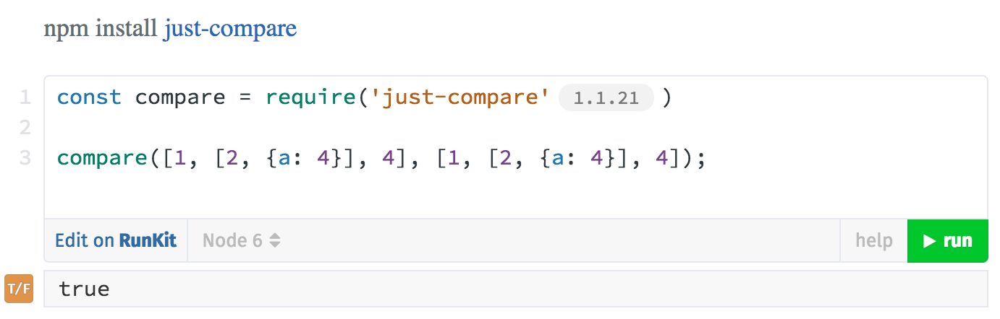

## Just :cherries:

[](http://travis-ci.org/angus-c/just.js)

A library of **zero-dependency** npm modules that do just do one thing.
Guilt-free utilities for every occasion.

## Try :icecream:
[Editable, runnable examples](http://anguscroll.com/just) of every utility (powered by [RunKit](https://runkit.com))
<a href="http://anguscroll.com/just"></a>
## Read :books:
[The Zen of Dependency-Free –- Why I wrote Just](https://medium.com/@angustweets/just-a12d54221f65#.ljib0mfr5)

## The Modules :package:

* [Collections](#collections)
  * [just-compare](#just-compare)
  * [just-pluck-it](#just-pluck-it)
  * [just-flush](#just-flush)  
* [Objects](#objects)
  * [just-extend](#just-extend)
  * [just-values](#just-values)
  * [just-entries](#just-entries)  
  * [just-pick](#just-pick)
  * [just-omit](#just-omit)
  * [just-filter-object](#just-filter-object)
  * [just-map-object](#just-map-object)
  * [just-reduce-object](#just-reduce-object)
  * [just-is-empty](#just-is-empty)
  * [just-is-circular](#just-is-circular)  
  * [just-is-primitive](#just-is-primitive)      
  * [just-safe-get](#just-safe-get)
  * [just-safe-set](#just-safe-set)
  * [just-typeof](#just-typeof)
  * [just-flip-object](#just-flip-object)
* [Arrays](#arrays)
  * [just-unique](#just-unique)
  * [just-flatten-it](#just-flatten-it)
  * [just-index](#just-index)
  * [just-insert](#just-insert)
  * [just-intersect](#just-intersect)
  * [just-compact](#just-compact)  
  * [just-last](#just-last)
  * [just-tail](#just-tail)
  * [just-random](#just-random)
  * [just-shuffle](#just-shuffle)  
  * [just-range](#just-range)
  * [just-remove](#just-remove)
  * [just-union](#just-union)
* [Strings](#strings)
  * [just-template](#just-template)
  * [just-truncate](#just-truncate)
  * [just-prune](#just-prune)      
  * [just-squash](#just-squash)  
  * [just-left-pad](#just-left-pad)
  * [just-right-pad](#just-right-pad)
  * [just-camel-case](#just-camel-case)              
  * [just-kebab-case](#just-kebab-case)              
  * [just-snake-case](#just-snake-case)                  
* [Numbers](#numbers)
  * [just-clamp](#just-clamp)  
  * [just-modulo](#just-modulo)  
* [Functions](#functions)
  * [just-compose](#just-compose)
  * [just-curry-it](#just-curry-it)
  * [just-demethodize](#just-demethodize)
  * [just-flip](#just-flip)
  * [just-partial-it](#just-partial-it)
  * [just-debounce-it](#just-debounce-it)

### Collections

### [just-compare](https://www.npmjs.com/package/just-compare)
:icecream:[`Try It`](http://anguscroll.com/just/just-compare)

`npm install just-compare`

```js
import compare from 'just-compare';

// primitives: value1 === value2
// functions: value1.toString == value2.toString
// arrays: if length, sequence and values of properties are identical
// objects: if length, names and values of properties are identical
compare([[1, [2, 3]], [[1, [2, 3]]); // true
compare([[1, [2, 3], 4], [[1, [2, 3]]); // false
compare({a: 2, b: 3}, {a: 2, b: 3}); // true
compare({a: 2, b: 3}, {b: 3, a: 2}); // true
compare({a: 2, b: 3, c: 4}, {a: 2, b: 3}); // false
compare({a: 2, b: 3}, {a: 2, b: 3, c: 4}); // false
compare([[1, [2, {a: 4}], 4], [[1, [2, {a: 4}]]); // true
```

### [just-pluck-it](https://www.npmjs.com/package/just-pluck-it)
:icecream:[`Try It`](http://anguscroll.com/just/just-pluck-it)

`npm install just-pluck-it`

```js
import pluck from 'just-pluck-it';

pluck([{a:1, b:2}, {a:4, b:3}, {a:2, b:5}], 'a'); // [1, 4, 2]
pluck({x: {a:1, b:2}, y: {a:4, b:3}, z: {a:2, b:5}}, 'a'); // {x: 1, y: 4, z: 2}
```

### [just-flush](https://www.npmjs.com/package/just-flush)
:icecream:[`Try It`](http://anguscroll.com/just/just-flush)

`npm install just-flush`

```js
import flush from 'just-flush';

flush([1, undefined, 2, null, 3, NaN, 0]); // [1, 2, 3, NaN, 0]
flush([true, null, false, true, [null], undefined]); // [true, false, [null], true]
flush({a: 2, b: null, c: 4, d: undefined}); // {a: 2, c: 4}
flush('something'); // undefined
flush(); // undefined
```

### Objects

### [just-extend](https://www.npmjs.com/package/just-extend)
:icecream:[`Try It`](http://anguscroll.com/just/just-extend)

`npm install just-extend`

```js
import extend from 'just-extend';

let obj = {a: 3, b: 5};
extend(obj, {a: 4, c: 8}); // {a: 4, b: 5, c: 8}
obj; // {a: 4, b: 5, c: 8}

let obj = {a: 3, b: 5};
extend({}, obj, {a: 4, c: 8}); // {a: 4, b: 5, c: 8}
obj; // {a: 3, b: 5}

let arr = [1, 2, 3];
let obj = {a: 3, b: 5};
extend(obj, {c: arr}); // {a: 3, b: 5, c: [1, 2, 3]}
arr.push[4];
obj; // {a: 3, b: 5, c: [1, 2, 3, 4]}

let arr = [1, 2, 3];
let obj = {a: 3, b: 5};
extend(true, obj, {c: arr}); // {a: 3, b: 5, c: [1, 2, 3]}
arr.push[4];
obj; // {a: 3, b: 5, c: [1, 2, 3]}
```
### [just-values](https://www.npmjs.com/package/just-values)
:icecream:[`Try It`](http://anguscroll.com/just/just-values)

`npm install just-values`

```js
import values from 'just-values';

values({a: 4, c: 8}); // [4, 8]
values({a: {aa: 2}, b: {bb: 4}}); // [{aa: 2}, {bb: 4}]
values({}); // []
values([1, 2, 3]); // [1, 2, 3]
values(function(a, b) {return a + b;}); // []
values(String('hello')); // []
values(1); // throw exception
values(true); // throw exception
values(undefined); // throw exception
values(null); // throw exception
```
### [just-entries](https://www.npmjs.com/package/just-entries)
:icecream:[`Try It`](http://anguscroll.com/just/just-entries)

`npm install just-entries`

```js
import entries from 'just-entries';

// Object:
entries({c: 8, a: 4}); // [['c', 8], ['a', 4]]
entries({b: {bb: 4}, a: {aa: 2}}); // [['b', {bb: 4}], ['a', {aa: 2}]]
entries({}); // []

// Array:
entries([{c: 8}, {a: 4}]); // [[0, {c: 8}], [1, {a: 4}]]
entries(['À', 'mauvais', 'ouvrier', 'point', 'de', 'bon', 'outil'])
// [[0, 'À'], [1, 'mauvais'] ... [6, 'outil']]
entries([]); // []
```
### [just-pick](https://www.npmjs.com/package/just-pick)
:icecream:[`Try It`](http://anguscroll.com/just/just-pick)

`npm install just-pick`

```js
import pick from 'just-pick';

var obj = {a: 3, b: 5, c: 9};
pick(obj, ['a', 'c']); // {a: 3, c: 9}
pick(obj, 'a', 'c'); // {a: 3, c: 9}
pick(obj, ['a', 'b', 'd']); // {a: 3, b: 5, d: undefined}
pick(obj, ['a', 'a']); // {a: 3}
```
### [just-omit](https://www.npmjs.com/package/just-omit)
:icecream:[`Try It`](http://anguscroll.com/just/just-omit)

`npm install just-omit`

```js
import omit from 'just-omit';

var obj = {a: 3, b: 5, c: 9};
omit(obj, ['a', 'c']); // {b: 5}
omit(obj, 'a', 'c'); // {b: 5}
omit(obj, ['a', 'b', 'd']); // {c: 9}
omit(obj, ['a', 'a']); // {b: 5, c: 9}
```
### [just-is-empty](https://www.npmjs.com/package/just-is-empty)
:icecream:[`Try It`](http://anguscroll.com/just/just-is-empty)

`npm install just-is-empty`

```js
import isEmpty from 'just-is-empty';

isEmpty({a: 3, b: 5}) // false
isEmpty(['a','b']) // false
isEmpty({}) // true
isEmpty([]) // true
isEmpty(null) // true
isEmpty(undefined) // true
```
### [just-is-circular](https://www.npmjs.com/package/just-is-circular)
:icecream:[`Try It`](http://anguscroll.com/just/just-is-circular)

`npm install just-is-circular`

```js
import isCircular from 'just-is-circular';

const a = {};
a.b = a;
isCircular(a) // true

const a = {};
a.b = {c: a}
isCircular(a) // true

const a = {};
a.b = {c: 4}
isCircular(a) // false

const a = [];
a.push(a);
isCircular(a) // true

isCircular({}) // false
isCircular('hi') // false
isCircular(undefined) // false
```
### [just-is-primitive](https://www.npmjs.com/package/just-is-primitive)
:icecream:[`Try It`](http://anguscroll.com/just/just-is-primitive)

`npm install just-is-primitive`

```js
import isPrimitive from 'just-is-primitive';
isPrimitive('hi') // true
isPrimitive(3) // true
isPrimitive(true) // true
isPrimitive(false) // true
isPrimitive(null) // true
isPrimitive(undefined) // true
isPrimitive(Symbol()) // true
isPrimitive({}) // false
isPrimitive([]) // false
isPrimitive(function() {}) // false
isPrimitive(new Date()) // false
isPrimitive(/a/) // false
```
### [just-filter-object](https://www.npmjs.com/package/just-filter-object)
:icecream:[`Try It`](http://anguscroll.com/just/just-filter-object)

`npm install just-filter-object`

```js
import filter from 'just-filter-object';

// returns a new object containing those original properties for which the predicate returns truthy
filter({a: 3, b: 5, c: 9}, (key, value) => value < 6); // {a: 3, b: 5}
filter({a1: 3, b1: 5, a2: 9}, (key, value) => key[0] == 'a'); // {a1: 3, a2: 9}
filter({a: 3, b: 5, c: null}, (key, value) => value); // {a: 3, b: 5}
```

### [just-map-object](https://www.npmjs.com/package/just-map-object)
:icecream:[`Try It`](http://anguscroll.com/just/just-map-object)

`npm install just-map-object`

```js
import map from 'just-map-object';

// returns a new object with the predicate applied to each value
map({a: 3, b: 5, c: 9}, (key, value) => value + 1); // {a: 4, b: 6, c: 10}
map({a: 3, b: 5, c: 9}, (key, value) => key); // {a: 'a', b: 'b', c: 'c'}
map({a: 3, b: 5, c: 9}, (key, value) => key + value); // {a: 'a3', b: 'b5', c: 'c9'}
```

### [just-reduce-object](https://www.npmjs.com/package/just-reduce-object)
:icecream:[`Try It`](http://anguscroll.com/just/just-reduce-object)

`npm install just-reduce-object`

```js
import reduce from 'just-reduce-object';

// applies a function against an accumulator and each key-value pairs of the object
// to reduce it to a single value
reduce({a: 3, b: 5, c: 9}, (acc, key, value, index, keys) => {
  acc[value] = key;
  return acc;
}, {}); // {3: 'a', 5: 'b', 9: 'c'}

reduce({a: 3, b: 5, c: 9}, (acc, key, value, index, keys) => {
  acc += value;
  return acc;
}); // 17
```
### [just-safe-get](https://www.npmjs.com/package/just-safe-get)
:icecream:[`Try It`](http://anguscroll.com/just/just-safe-get)

`npm install just-safe-get`

```js
import get from 'just-safe-get';

const obj = {a: {aa: {aaa: 2}}, b: 4};

get(obj, 'a.aa.aaa'); // 2
get(obj, ['a', 'aa', 'aaa']); // 2

get(obj, 'b.bb.bbb'); // undefined
get(obj, ['b', 'bb', 'bbb']); // undefined

get(obj.a, 'aa.aaa'); // 2
get(obj.a, ['aa', 'aaa']); // 2

get(obj.b, 'bb.bbb'); // undefined
get(obj.b, ['bb', 'bbb']); // undefined
```

### [just-safe-set](https://www.npmjs.com/package/just-safe-set)
:icecream:[`Try It`](http://anguscroll.com/just/just-safe-set)

`npm install just-safe-set`

```js
import set from 'just-safe-set';

const obj1 = {};
set(obj1, 'a.aa.aaa', 4}); // true
obj1; // {a: {aa: {aaa: 4}}}

const obj2 = {};
set(obj2, [a, aa, aaa], 4}); // true
obj2; // {a: {aa: {aaa: 4}}}

const obj3 = {a: {aa: {aaa: 2}}};
set(obj3, 'a.aa.aaa', 3); // true
obj3; // {a: {aa: {aaa: 3}}}

const obj4 = {a: {aa: {aaa: 2}}};
set(obj4, 'a.aa', {bbb: 7}); // true
obj4; // {a: {aa: {bbb: 7}}}
```

### [just-typeof](https://www.npmjs.com/package/just-typeof)
:icecream:[`Try It`](http://anguscroll.com/just/just-typeof)

`npm install just-typeof`

```js
import typeOf from 'just-typeof';

typeOf({}); // 'object'
typeOf([]); // 'array'
typeOf(function() {}); // 'function'
typeOf(/a/); // 'regexp'
typeOf(new Date()); // 'date'
typeOf(null); // 'null'
typeOf(undefined); // 'undefined'
typeOf('a'); // 'string'
typeOf(1); // 'number'
typeOf(true); // 'boolean'
```

### [just-flip-object](https://www.npmjs.com/package/just-flip-object)
:icecream:[`Try It`](http://anguscroll.com/just/just-flip-object)

`npm install just-flip-object`

```js
import flip from 'just-flip-object';

// flip the key and value
flip({a: 'x', b: 'y', c: 'z'}); // {x: 'a', y: 'b', z: 'c'}
flip({a: 1, b: 2, c: 3}); // {'1': 'a', '2': 'b', '3': 'c'}
flip({a: false, b: true}); // {false: 'a', true: 'b'}
```

### Arrays

### [just-unique](https://www.npmjs.com/package/just-unique)
:icecream:[`Try It`](http://anguscroll.com/just/just-unique)

`npm install just-unique`

```js
import unique from 'just-unique';

unique([1, 2, 3, 2, 3, 4, 3, 2, 1, 3]); // [1, 2, 3, 4]

var a = {a: 3};
var b = {b: 4};
var c = {c: 5};
unique([a, a, b, c, b]); // [a, b, c]

unique([1, '1', 2, '2', 3, 2]); // [1, '1', 2, '2', 3]

// declaring sorted array for performance
unique([1, 1, '1', 2, 2, 5, '5', '5'], true); // [1, '1', 2, 5, '6']

// declaring strings array for performance
unique(['a', 'c', 'b', 'c', 'a'], false, true); // ['a', 'b', 'c']
```

### [just-flatten-it](https://www.npmjs.com/package/just-flatten-it)
:icecream:[`Try It`](http://anguscroll.com/just/just-flatten-it)

`npm install just-flatten-it`

```js
import flatten from 'just-flatten-it';

flatten([[1, [2, 3]], [[4, 5], 6, 7, [8, 9]]]);
// [1, 2, 3, 4, 5, 6, 7, 8, 9]
```

### [just-index](https://www.npmjs.com/package/just-index)
:icecream:[`Try It`](http://anguscroll.com/just/just-index)

`npm install just-index`

```js
import index from 'just-index';

index([{id: 'first', val: 1}, {id: 'second', val: 2}], 'id');
// {first: {id: 'first', val: 1}, second: {id: 'second', val: 2}}
index([{id: 'first', val: 1}, null], 'id'); // {first: {id: 'first', val: 1}}
index([], 'id'); // {}
index([], null); // undefined
index({}, 'id'); // undefined
```

### [just-insert](https://www.npmjs.com/package/just-insert)
:icecream:[`Try It`](http://anguscroll.com/just/just-insert)

`npm install just-insert`

```js
import insert from 'just-insert';

insert([1, 2, 5, 6], ['a', 'c', 'e'], 2); // [1, 2, 'a', 'c', 'e', 5, 6]
insert([1, 2, 5, 6], 'a', 2); // [1, 2, 'a', 5, 6]
insert([1, 2, 5, 6], ['a', 'c', 'e'], 0); // ['a', 'c', 'e', 1, 2, 5, 6]
insert([1, 2, 5, 6], ['a', 'c', 'e']); // ['a', 'c', 'e', 1, 2, 5, 6]
```

### [just-intersect](https://www.npmjs.com/package/just-intersect)
:icecream:[`Try It`](http://anguscroll.com/just/just-intersect)

`npm install just-intersect`

```js
import intersect from 'just-intersect';

intersect([1, 2, 5, 6], [2, 3, 5, 6]); // [2, 5, 6]
```

### [just-compact](https://www.npmjs.com/package/just-compact)
:icecream:[`Try It`](http://anguscroll.com/just/just-compact)

`npm install just-compact`

```js
import compact from 'just-compact';

compact([1, null, 2, undefined, null, NaN, 3, 4, false, 5]); // [1, 2, 3, 4, 5]
compact([1, 2, [], 4, {}]); // [1, 2, [], 4, {}]
compact([]); // []
compact({}); // undefined
```

### [just-last](https://www.npmjs.com/package/just-last)
:icecream:[`Try It`](http://anguscroll.com/just/just-last)

`npm install just-last`

```js
import last from 'just-last';

last([1, 2, 3, 4, 5]); // 5
last([{a: 1}, {b: 1}, {c: 1}]); // {c: 1}
last([true, false, [true, false]]); // [true, false]
last(); // undefined
last([]); // undefined
last(null); // undefined
last(undefined); // undefined
```

### [just-tail](https://www.npmjs.com/package/just-tail)
:icecream:[`Try It`](http://anguscroll.com/just/just-tail)

`npm install just-tail`

```js
import tail from 'just-tail';

tail([1, 2, 3, 4, 5]); // [2, 3, 4, 5]
tail([{a: 1}, {b: 1}, {c: 1}]); // [{b: 1}, {c: 1}]
tail([true, false, [true, false]]); // [false, [true, false]]
tail([]); // []
tail(); // undefined
tail(null); // undefined
tail(undefined); // undefined
```

### [just-random](https://www.npmjs.com/package/just-random)
:icecream:[`Try It`](http://anguscroll.com/just/just-random)

`npm install just-random`

```js
import random from 'just-random';

random([1, 2, 3]); // one of [1, 2, 3], at random
```

### [just-shuffle](https://www.npmjs.com/package/just-shuffle)
:icecream:[`Try It`](http://anguscroll.com/just/just-shuffle)

`npm install just-shuffle`

```js
import shuffle from 'just-shuffle';

shuffle([1, 2, 3]); // array with original elements randomly sorted
shuffle([1]); // [1]
shuffle(); // undefined
shuffle(undefined); // undefined
shuffle(null); // undefined
shuffle({}); // undefined
```

### [just-range](https://www.npmjs.com/package/just-range)
:icecream:[`Try It`](http://anguscroll.com/just/just-range)

`npm install just-range`

```js
import range from 'just-range';

range(1, 5); // [1, 2, 3, 4]
range(5); // [0, 1, 2, 3, 4]
range(-5); // [0, -1, -2, -3, -4]
range(0, 20, 5) // [0, 5, 10, 15]
```

### [just-remove](https://www.npmjs.com/package/just-remove)
:icecream:[`Try It`](http://anguscroll.com/just/just-remove)

`npm install just-remove`

```js
import remove from 'just-remove';

remove([1, 2, 3, 4, 5, 6], [1, 3, 6]); // [2, 4, 5]
```

### [just-union](https://www.npmjs.com/package/just-union)
:icecream:[`Try It`](http://anguscroll.com/just/just-union)

`npm install just-union`

```js
import union from 'just-union';

union([1, 2, 5, 6], [2, 3, 4, 6]); // [1, 2, 3, 4, 5, 6]
```

### Strings

### [just-template](https://www.npmjs.com/package/just-template)
:icecream:[`Try It`](http://anguscroll.com/just/just-template)

`npm install just-template`

```js
import template from 'just-template';

const data = {
  a: {
    aa: {
      aaa: 'apple',
      bbb: 'pear'
    },
    bb: 'orange'
  },
  b: 'plum'
};
template('2 ${a.aa.aaa}s, a ${a.aa.bbb}, 3 ${a.bb}s and a ${b}. Yes 1 ${a.aa.bbb}.', data);
// '2 apples, a pear, 3 oranges and a plum. Yes 1 pear.'
```

### [just-truncate](https://www.npmjs.com/package/just-truncate)
:icecream:[`Try It`](http://anguscroll.com/just/just-truncate)

`npm install just-truncate`

```js
  truncate('when shall we three meet again', 9); // 'when s...'
  truncate('when shall we three meet again', 12, ' (etc)'); // 'when s (etc)'
  truncate('when shall we', 15,); // 'when shall we'
  truncate('when shall we', 15, '(more)'); // 'when shall we'
  truncate('when shall we', 10, ' (etc etc etc)'); // ' (etc etc etc)'
```

### [just-prune](https://www.npmjs.com/package/just-prune)
:icecream:[`Try It`](http://anguscroll.com/just/just-prune)

`npm install just-prune`

```js
  prune('when shall we three meet again', 7); // 'when...'
  prune('when shall we three meet again', 7, ' (more)'; // 'when (more)'
  prune('when shall we', 15,); // 'when shall we'
  prune('when shall we', 15, ' (etc)'); // 'when shall we'
  prune('when shall we', 7, ' (more)'); // ' (more)'
```

### [just-squash](https://www.npmjs.com/package/just-squash)
:icecream:[`Try It`](http://anguscroll.com/just/just-squash)

`npm install just-squash`

```js
  squash('the cat sat on the mat'); // 'thecatsatonthemat'
  squash(' the cat sat on the mat '); // 'thecatsatonthemat'
  squash('\tthe cat\n sat \fon \vthe \rmat '); // '\tthecat\nsat\fon\vthe\rmat'
  squash('\tthe cat\n sat \fon \vthe \rmat ', true); // 'thecatsatonthemat'
  squash(`the cat
sat on the mat`, true); // thecatsatonthemat
```

### [just-left-pad](https://www.npmjs.com/package/just-left-pad)
:icecream:[`Try It`](http://anguscroll.com/just/just-left-pad)

`npm install just-left-pad`

```js
  leftPad('hello', 9); // '    hello'
  leftPad('hello', 3); 'hello'
  leftPad('hello', 9, '.'); '....hello'
  leftPad(['hello'], 7, '_'); '__hello'
  leftPad(null, 7); '   null'
```

### [just-right-pad](https://www.npmjs.com/package/just-right-pad)
:icecream:[`Try It`](http://anguscroll.com/just/just-right-pad)

`npm install just-right-pad`

```js
  rightPad('hello', 9); // 'hello    '
  rightPad('hello', 3); 'hello'
  rightPad('hello', 9, '.'); 'hello....'
  rightPad(['hello'], 7, '_'); 'hello__'
  rightPad(null, 7); 'null '
```

### [just-camel-case](https://www.npmjs.com/package/just-camel-case)
:icecream:[`Try It`](http://anguscroll.com/just/just-camel-case)

`npm install just-camel-case`

```js
  camelCase('the quick brown fox'); // 'theQuickBrownFox'
  camelCase('the_quick_brown_fox'); // 'theQuickBrownFox'
  camelCase('the-quick-brown-fox'); // 'theQuickBrownFox'
  camelCase('theQuickBrownFox'); // 'theQuickBrownFox'
  camelCase('thequickbrownfox'); // 'thequickbrownfox'
  camelCase('the - quick * brown# fox'); // 'theQuickBrownFox'
  camelCase('theQUICKBrownFox'); // 'theQUICKBrownFox'
```

### [just-kebab-case](https://www.npmjs.com/package/just-kebab-case)
:icecream:[`Try It`](http://anguscroll.com/just/just-kebab-case)

`npm install just-kebab-case`

```js
  kebabCase('the quick brown fox'); // 'the-quick-brown-fox'
  kebabCase('the-quick-brown-fox'); // 'the-quick-brown-fox'
  kebabCase('the_quick_brown_fox'); // 'the-quick-brown-fox'
  kebabCase('theQuickBrownFox'); // 'the-quick-brown-fox'
  kebabCase('theQuickBrown Fox'); // 'the-quick-brown-fox'
  kebabCase('thequickbrownfox'); // 'thequickbrownfox'
  kebabCase('the - quick * brown# fox'); // 'the-quick-brown-fox'
  kebabCase('theQUICKBrownFox'); // 'the-q-u-i-c-k-brown-fox'
```

### [just-snake-case](https://www.npmjs.com/package/just-snake-case)
:icecream:[`Try It`](http://anguscroll.com/just/just-snake-case)

`npm install just-snake-case`

```js
  snakeCase('the quick brown fox'); // 'the_quick_brown_fox'
  snakeCase('the-quick-brown-fox'); // 'the_quick_brown_fox'
  snakeCase('the_quick_brown_fox'); // 'the_quick_brown_fox'
  snakeCase('theQuickBrownFox'); // 'the_quick_brown_fox'
  snakeCase('theQuickBrown Fox'); // 'the_quick_brown_Fox'
  snakeCase('thequickbrownfox'); // 'thequickbrownfox'
  snakeCase('the - quick * brown# fox'); // 'the_quick_brown_fox'
  snakeCase('theQUICKBrownFox'); // 'the_q_u_i_c_k_brown_fox'
```

### Numbers

### [just-clamp](https://www.npmjs.com/package/just-clamp)
:icecream:[`Try It`](http://anguscroll.com/just/just-clamp)

`npm install just-clamp`

```js
import clamp from 'just-clamp';

var n = 5;
clamp(1, n, 12); // 5
clamp(1, n, 3); // 3
clamp(8, n, 9); // 8
clamp(0, n, 0); // 0
n = undefined;
clamp(3, n, 8); // 3
n = null;
clamp(3, n, 8); // 3
n = NaN;
clamp(3, n, 8); // 3
```

### [just-modulo](https://www.npmjs.com/package/just-modulo)
:icecream:[`Try It`](http://anguscroll.com/just/just-modulo)

`npm install just-modulo`

```js
import modulo from 'just-modulo';

modulo(7, 5); // 2
modulo(17, 23); // 17
modulo(16.2, 3.8); // 17
modulo(5.8, 3.4); //2.4
modulo(4, 0); // 4
modulo(-7, 5); // 3
modulo(-2, 15); // 13
modulo(-5.8, 3.4); // 1
modulo(12, -1); // NaN
modulo(-3, -8); // NaN
modulo(12, 'apple'); // NaN
modulo('bee', 9); // NaN
modulo(null, undefined); // NaN
```

### Functions

### [just-compose](https://www.npmjs.com/package/just-compose)
:icecream:[`Try It`](http://anguscroll.com/just/just-compose)

`npm install just-compose`

```js
import compose from 'just-compose';

const sqRootBiggest = compose(Math.max, Math.sqrt, Math.trunc);
sqRootBiggest(10, 5); // 3
sqRootBiggest(7, 0, 16); // 4
```

### [just-curry-it](https://www.npmjs.com/package/just-curry-it)
:icecream:[`Try It`](http://anguscroll.com/just/just-curry-it)

`npm install just-curry-it`

```js
import curry from 'just-curry-it';

function converter(ratio, input) {
  return (input*ratio).toFixed(1);
}
const milesToKm = curry(converter)(1.62);
milesToKm(35); // 56.7
milesToKm(10); // 16.2
```

### [just-demethodize](https://www.npmjs.com/package/just-demethodize)
:icecream:[`Try It`](http://anguscroll.com/just/just-demethodize)

`npm install just-demethodize`

```js
const demethodize = require('just-demethodize');

const trimFn = demethodize(''.trim);
['hello ', ' goodbye', 'hello again'].map(trimFn)
```

### [just-flip](https://www.npmjs.com/package/just-flip)
:icecream:[`Try It`](http://anguscroll.com/just/just-flip)

`npm install just-flip`

```js
import flip from 'just-flip';

flip(console.log)(1, 2, 3) // 2, 1, 3
```

### [just-partial-it](https://www.npmjs.com/package/just-partial-it)
:icecream:[`Try It`](http://anguscroll.com/just/just-partial-it)

`npm install just-partial-it`

```js
import partial from 'just-partial-it';

const cubedRoot = partial(Math.pow, undefined, 1/3);
cubedRoot(10).toFixed(1); // 56.7
cubedRoot(35).toFixed(1); // 16.2
```
### [just-debounce-it](https://www.npmjs.com/package/just-debounce-it)
:icecream:[`Try It`](http://anguscroll.com/just/just-debounce-it)

`npm install just-debounce-it`

```js
import debounce from 'just-debounce-it';

const fn1 = debounce(() => console.log('Hello'), 500);
fn1();
fn1();
fn1();
// 500ms later logs 'hello' once

const fn2 = debounce(() => console.log('Hello'), 500, true);
fn2(); // logs hello immediately
fn2();
fn2();
// 500ms later logs 'hello' once

```

## Testing

Run all tests as a single test suite with

```npm run test```

## Contribute!

I welcome pull requests for additional utilities (and corrections to existing ones).

## New Module Guidelines
* must not depend on any other npm modules
* assume this is hot code and code accordingly
  * favor for loops over high order functions
  * don't repeatedly access the same property, assign to a var
  * write es5
* api
  * keep the api simple and intuitive
  * avoid edge case arguments whenever possible
* README
  * limit README to examples of each use case
  * if you must explain the api (see api section) add a comment in the README example code
  * add a section in the general README that matches the README for your module
* tests
  * write a test for each use case
  * include tests for all README examples
* Interactive gh-page (anguscroll.com/just)
  * I can update this afterwards
