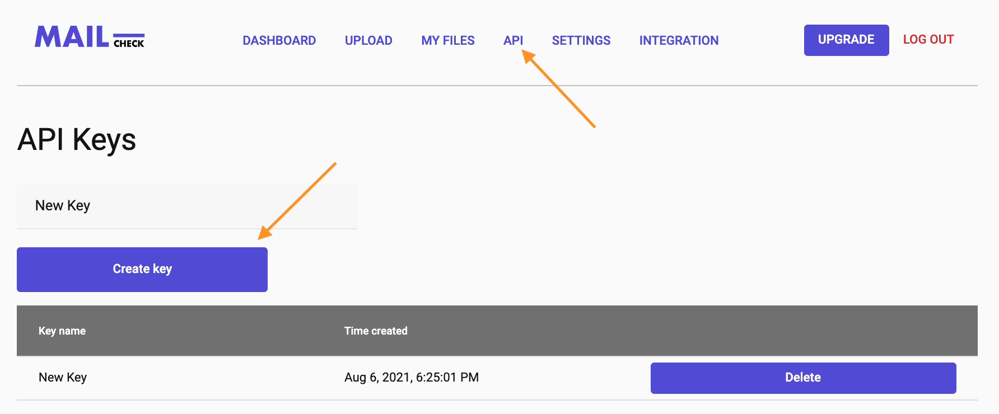
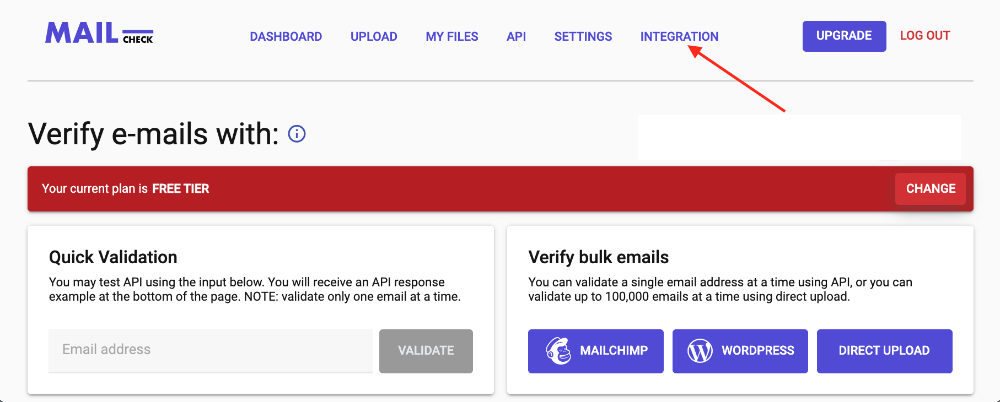

# {title}

{readingTime}

The pace e-commerce is expanding with and the number of sales occurring per minute is growing so fast that these days it is nearly impossible to run a business without an email verifier. If you are already using one - well done, but if you are still in search of a better-than-average email verifier, look no more. Mailcheck is a high-accuracy, easy-to-use email verification platform that provides quick email validation for hassle-free, no-bounce email campaigns. Mailcheck works to increase your deliverability rate, and what’s more - it is now possible to integrate with other most popular platforms. Let’s have a closer look at the platforms Mailcheck integrates with, how it works and how you can benefit from it.

## Mailchimp

Mailchimp is an integrated marketing platform that offers a variety of services. You can create a website, launch an online store, manage the relationship with your customers, automate your marketing efforts and many many more. If email is your primary means of communication with customers, you probably know how much time and effort it takes to put up a good and catchy email campaign, so investing many efforts into something that may bounce back because of a recipient’s invalid or non-existing email address is not what you wanted. This is where Mailcheck backs things up. It integrates with Mailchimp by enabling specific filters, so all the emails a campaign is set to be sent to are screened for validity. So if faulty emails are detected, they will be marked as “invalid”. Aside from invalid, Mailcheck will also tell you what emails are “risky but deliverable” by tagging them accordingly, so you can go ahead and remove them from your subscribers' list. As simple as that! All you need is to be subscribed to both Mailchimp and Mailcheck. If you need more detailed instructions, head on to [mailchimp-integration](/mailchimp-integration) or click on the Integration tab on your Mailcheck account dashboard.

## Zapier

If your daily business routine relies on multiple apps, and if you use Zapier to integrate them between one another, the good news is Mailcheck too can be configured through Zapier to work with all your apps. Zapier is a tool that helps you integrate many apps with each other without having to hire a developer to do the integration manually. The perks are, as you have probably guessed - it saves you time and money. All you need is a Mailcheck, Zapier and Google account. The good thing is that Mailcheck is included in the free Zapier features, so a free Zapier account will do. Next, you will need an API key, which you can get through your Mailcheck dashboard and a spreadsheet in Google Drive. We at Mailcheck have come up with a detailed integration guide [here](/zapier-integration) to make the integration experience for you as flawless as possible.

## WordPress

Mailcheck integration with WordPress is probably the easiest and most convenient. In the case of WordPress, Mailcheck works as a plugin. All you need to do is to:

- create a Mailcheck account
- generate your API key from the API menu at the top of your account dashboard
  
- [download](https://www.mailcheck.co/l/wp) and install Mailcheck plugin.
  Right now the service integrates with WP-forms, ACF, Contact Form 7, WooCommerce and Elementor.

## Integromat

Integromat is another service that helps you connect apps with one another. So if you are using [Integromat](/integromat-integration), connecting Mailcheck with the rest of the apps will be a no-brainer. All you need is an Integromat, Mailcheck and any other account you want to connect Mailcheck with. For instance, integrating Mailcheck with Mailchimp will allow you to screen your email list before letting your email campaign out. This is very convenient as it will eliminate all the troubles caused by potentially fake emails in your list.

Getting started with each of the integrations is super easy. Mailcheck allocated a separate Integration menu on the user account dashboard. Simply login into your Mailcheck account, go to Integration at the top of the screen and choose the service you want to integrate through.

Mailcheck alone is a very efficient application that can be used on its own, but in combination with one of the above platforms, its effectiveness is doubled. And did I mention that is offers a free trial too? Head on to Mailcheck website to get a free trial and give those integrations a try.
