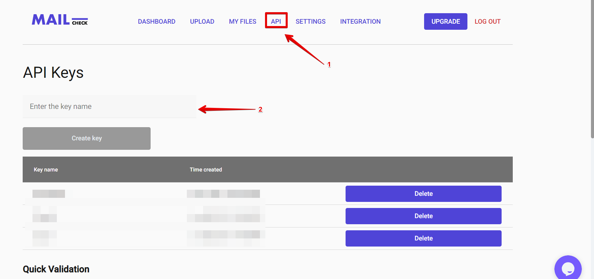
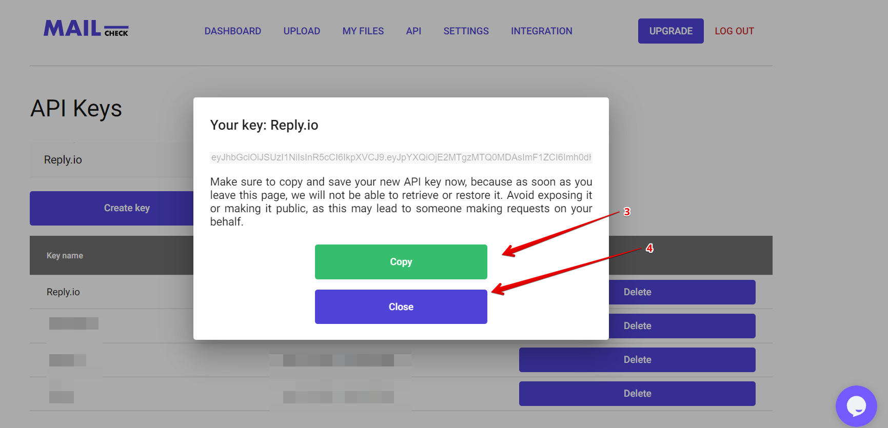

# {title}

In order to use the integrations most of them require an API key, which can be generated on any Mailcheck account.

## Step 1

Open your Mailcheck account and click “API” from the top menu.

## Step 2

Type the name of your Integration and tap “Create key”.

## Step 3

Copy your Key, now you can use it for your integrations.

Please note: don't share or send to anyone your API key.

Please reach out to us, should you have any questions [support@mailcheck.co](mailto:support+api@mailcheck.co)
