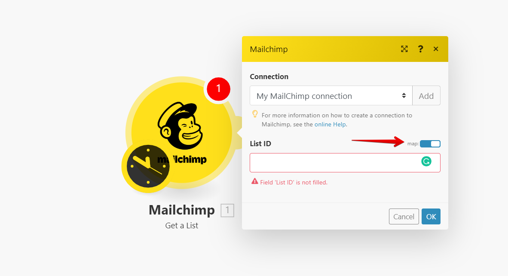

# **{title}**

## Step by step guide

### Step 1

- Open Mailcheck Integrations - [https://app.mailcheck.co/dashboard/integration](https://app.mailcheck.co/dashboard/integration)
  and click "Connect" you will be redirected into "Integromat"

### Step 2

- Click "Add to my inventory" and follow the instructions to "Sign up".
- Once signed up you can "Add to my inventory" our app and click "Start using Mailcheck".

### Step 3

- Choose the service you want to integrate with (Mailchimp, Google Sheet, ActiveCampaign, etc.)

- Once chosen click "Continue".

I am going to use "Mailchimp" as an example, however, you can use any of the existing apps based on your preferences.

### Step 4

- Click on the sign of Mailchimp or any other app you are using, and find "Get a list"
- Now, set you your Mailchimp account

- Follow the next steps to authorize your Mailchimp account

### Step 5

- Once authorized, deactivate "Map"

- Select your List (usually named under the name of the audience)

### Step 6

- Add another module

- Find Mailcheck to connect with the previous module

!choose api method in Integromat](./integromat-8.png)

- Click on "+" and type "Mailcheck"
- Choose "Single Email check"

### Step 7

- Click on "Add"
- Go to your Mailcheck account and click "API" from the Top menu

- Copy your API KEY and get back to Integromat to paste it

### Step 8

- Choose "Email from the modal window"

- And now we want to update our segment pasting "Mailcheck Trust rate" to define the validity of the email

### Step 9

- Adding another Mailchimp Module

- We need to choose "Mailchimp" again
- And from the Modal window "Add/Update subscriber"

### Step 10

- Choose your list from the dropdown menu and make sure "Map" disabled
- Choose on the "email address field "Email address" however, make sure the Map is "ENABLED"

### Step 11

- Set tag
- Choose "trust rate" from the modal window option

### Step 12

- Run once

And your integration is fully working now.
If you can't make it work, please reach out at [integromat@mailcheck.co](mailto:integromat@mailcheck.co)
